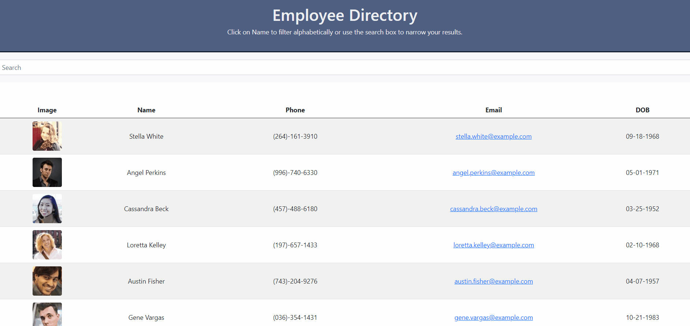

# React User Directory
## by Robert VanScoy
_______________________________________________________________
### Description 
* This project uses the randomuser.me API to generate a list of users. It also allows you to search and sort by name.
  
### License : 

  
* Info on license: https://opensource.org/licenses/MIT
_______________________________________________________________
### Installation Instructions:
* npm i in root directory . npm run start to run locally on Port 3000

_______________________________________________________________

### Main Language : 
* javascript

### Contribution Policy: 
* n/a
_______________________________________________________________

### Demo:

* Main Page

_______________________________________________________________

### Test Cases:
* n/a
_______________________________________________________________
### Contact Me 

* https://github.com/vanscoyro
* rvans003@fiu.edu

### TABLE OF CONTENTS 
_______________________________________________________________
* [Description](#description)
* [License](#license-)
* [Installation](#installation-instructions)
* [Main Language](#main-language-)
* [Contribution Policy](#contribution-policy)
* [Demo](#demo)
* [Test Case](#test-cases)
* [Contact Me](#contact-me)

    
  
